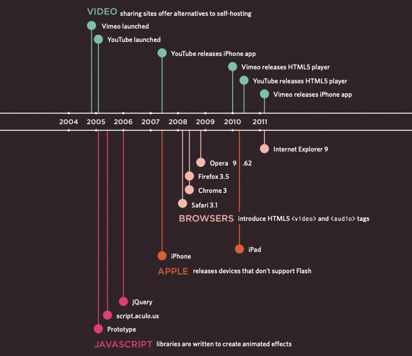

Readings: Audio, Video, Images
===

***Duckett HTML Book***
---

**Chapter 16:"Images"(pp.406-427)**

- You can specify the dimensions of images using CSS.
This is very helpful when you use the same sized
images on several pages of your site.
- Images can be aligned both horizontally and vertically
using CSS.
- You can use a background image behind the box
created by any element on a page.
- Background images can appear just once or be
repeated across the background of the box.
- You can create image rollover effects by moving the
background position of an image.
- To reduce the number of images your browser has to
load, you can create image sprites.

**Chapter 19:"Practical Information"(476-492)**

- It's important to understand who your target audience
is, why they would come to your site, what information
they want to find and when they are likely to return.
- Site maps allow you to plan the structure of a site.
- Wireframes allow you to organize the information that
will need to go on each page.
- Design is about communication. Visual hierarchy helps
visitors understand what you are trying to tell them.
- You can differentiate between pieces of information
using size, color, and style.
- You can use grouping and similarity to help simplify
the information you present.

**[Link to reading](https://developer.mozilla.org/en-US/docs/Learn/JavaScript/Client-side_web_APIs/Video_and_audio_APIs)**

**Chapter 9: "Pages 201-209 only"**

- Flash allows you to add animations, video and audio to
the web.
- Flash is not supported on iPhone or iPad.

