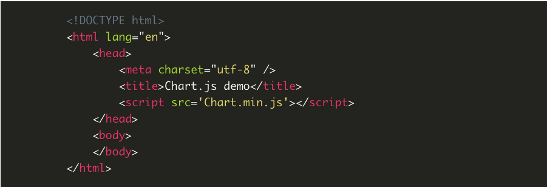
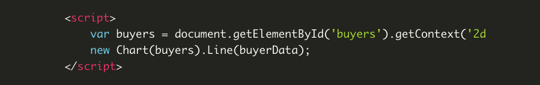
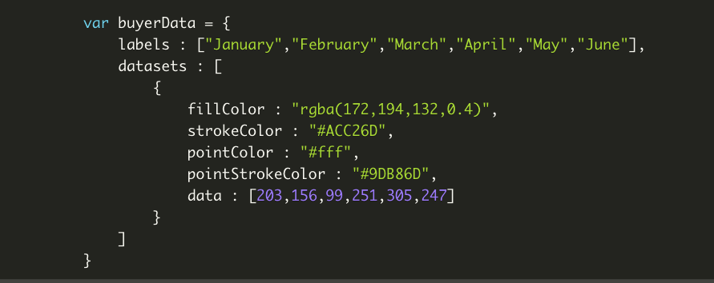

Readings: Chart.js, Canvas
===

***[link to artcle, "EASILY CREATE STUNNING ANIMATED CHARTS WITH CHART.JS"](https://www.webdesignerdepot.com/2013/11/easily-create-stunning-animated-charts-with-chart-js/)***

- The first thing we need to do is download Chart.js. Copy the Chart.min.js out of the unzipped folder and into the directory you’ll be working in. Then create a new html page and import the script:

- 

- To draw a line chart, the first thing we need to do is create a canvas element in our HTML in which Chart.js can draw our chart. So add this to the body of our HTML page:

- 

- Next, we need to write a script that will retrieve the context of the canvas, so add this to the foot of your body element:

- 

- Inside the same script tags we need to create our data, in this instance it’s an object that contains labels for the base of our chart and datasets to describe the values on the chart. Add this immediately above the line that begins ‘var buyers=’:

- 

**[Basic Usage](https://developer.mozilla.org/en-US/docs/Web/API/Canvas_API/Tutorial/Basic_usage)**

**[Drawing Shapes with Canvas](https://developer.mozilla.org/en-US/docs/Web/API/Canvas_API/Tutorial/Drawing_shapes)**

**[Applying styles with Canvas](https://developer.mozilla.org/en-US/docs/Web/API/Canvas_API/Tutorial/Drawing_shapes)**

**[Drawing Text](https://developer.mozilla.org/en-US/docs/Web/API/Canvas_API/Tutorial/Drawing_text)**

## Things I want to know more about

- I want to put what I've read on my pages.  It seems prettty difficult, but I'm ready to give it a shot. 