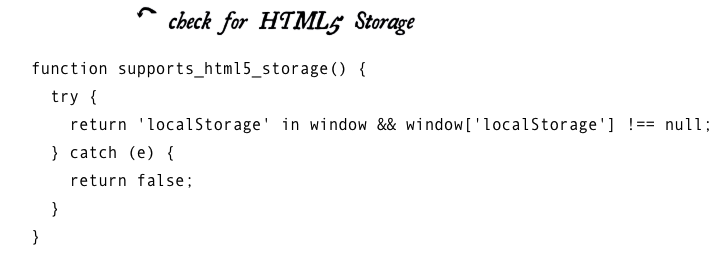
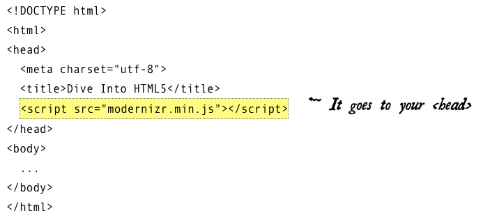
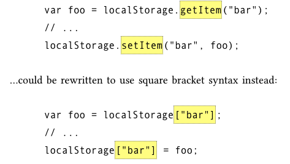
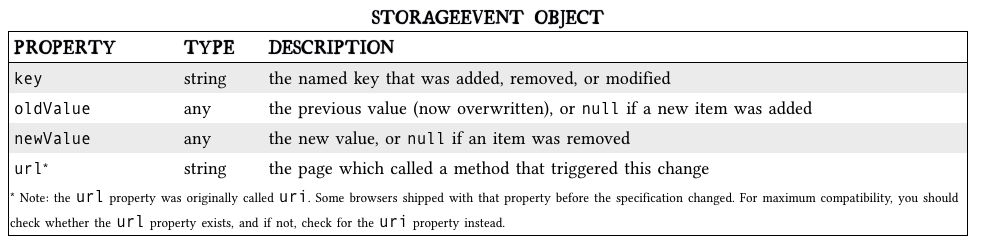
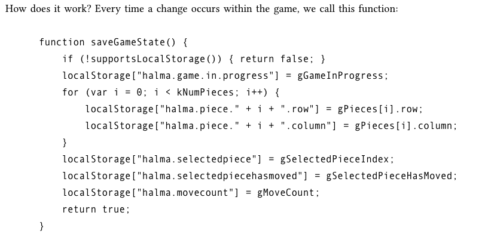

Readings: “The Past, Present, and Future of Local Storage for Web Applications”
===

***[Link to reading](http://diveinto.html5doctor.com/storage.html)***

**Introducing HTML5 Storage**
---

- it’s a way for web pages to store named key/value pairs locally, within the client web browser. Like cookies, this data persists even after you navigate away from the web site, close your browser tab, exit your browser

- this data is never transmitted to the remote web server (unless you go out of your way to send it manually)

- it is implemented natively in web browsers, so it is available even when third-party browser plugins are not.

- 

- Instead of writing this function yourself, you can use [Modernizr](http://diveinto.html5doctor.com/detect.html#modernizr) to detect support for HTML5 Storage.

- 

- Modernizr runs automatically. There is no modernizr_init() function to call. When it runs, it creates a global object called Modernizr, that contains a set of Boolean properties for each feature it can detect

**Using HTML5 Storage**
---

- HTML5 Storage is based on named key/value pairs. You store data based on a named key, then you can retrieve that data with the same key. The named key is a string.

- The data can be any type supported by JavaScript, including strings, Booleans, integers, or floats.

- If you are storing and retrieving anything other than strings, you will need to use functions like parseInt() or parseFloat() to coerce your retrieved data into the expected JavaScript datatype

- 

- 

- 

## Things I want to know more about

- I want to know how this actually pertains to what we are doin in class at the moment if it even does.  I'd like to see this in action.